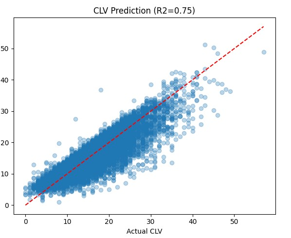
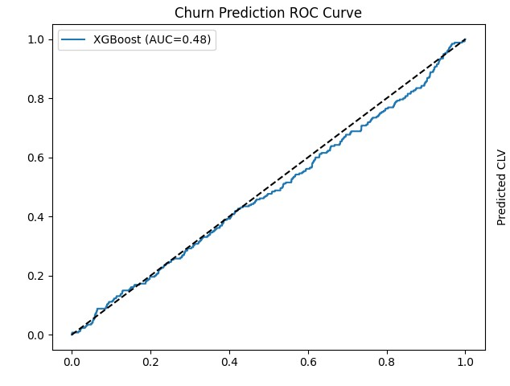

# 📊 Customer Churn & CLV Prediction System  
### XGBoost + FastAPI + ROI Optimization

An end-to-end machine learning pipeline that predicts:

- 🔴 **Customer Churn Probability**
- 💰 **Customer Lifetime Value (CLV)**
- 📈 **Optimal Email Frequency for ROI Maximization**

Built using **XGBoost**, **Scikit-Learn**, **FastAPI**, and **Matplotlib**.

---

## 🚀 Project Overview

This project analyzes a global email marketing campaign dataset and:

1. Aggregates customer behavior (first 9 months)
2. Predicts churn risk (months 10–12 inactivity)
3. Predicts total CLV
4. Optimizes email frequency for maximum ROI
5. Serves predictions via a REST API

---

## 🧠 Feature Engineering

Customer-level features are generated using:

- `emails_sent` (sum, mean)
- `opens` (sum, mean)
- `clicks` (sum, mean)
- `conversions` (sum, mean)

### Targets:
- **Churn** → No activity in months 10–12
- **CLV** → Total conversions across 12 months

---

## 🤖 Machine Learning Models

### 1️⃣ Churn Prediction Model
- Model: `XGBoostClassifier`
- Evaluation Metric: **ROC-AUC**

### ROC Curve



*(Replace with correct path if needed)*

---

### 2️⃣ CLV Prediction Model
- Model: `XGBoostRegressor`
- Evaluation Metric: **R² Score**

### CLV Regression Performance



*(Replace with correct path if needed)*

---

## 📈 Send-Time Optimization (STO) & ROI Forecasting

The system:

- Simulates sending **1–20 emails per month**
- Predicts conversion impact
- Calculates ROI using:

\[
ROI = \frac{(PredictedRevenue - EmailCost)}{EmailCost}
\]

Where:
- Email cost = `$0.05`
- Revenue per conversion = `$25`

Returns:
```python
optimal_monthly_emails
